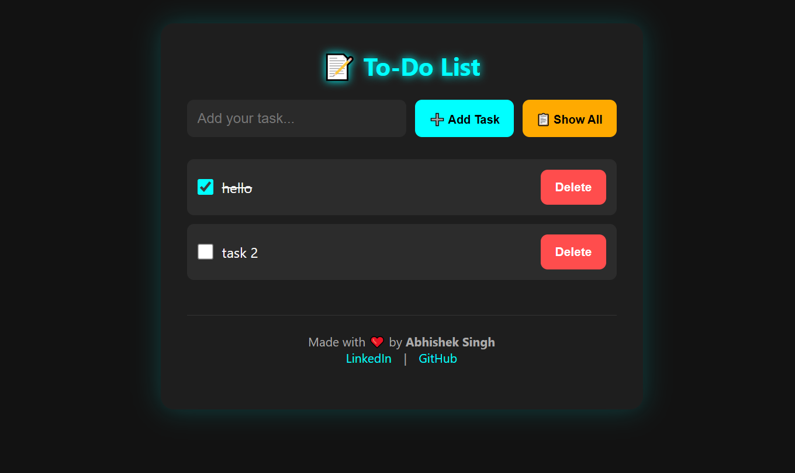

# 📝 PHP To-Do List App

https://chatgpt.com/share/6863a133-ca78-800b-9104-6392b7f44100

A sleek and modern **To-Do List App** built using **PHP**, **MySQL**, **JavaScript**, and **CSS**. Designed with a beautiful dark theme, glowing animations, and intuitive interactions — perfect for tracking tasks efficiently.

---
## 📸 Screenshot



## 🌟 Features

- ✅ Add new tasks without reloading (AJAX-powered)
- ✅ Mark tasks as completed
- ✅ Delete tasks instantly
- ✅ Show all tasks (completed + active)
- 🚫 Prevent duplicate entries
- 🎨 Dark theme with glowing neon UI
- ✨ CSS animations and hover effects
- 📱 Fully responsive for all devices

---

## 🚀 Tech Stack

- **PHP** – Backend logic
- **MySQL** – Task storage
- **JavaScript + AJAX** – Dynamic frontend interactions
- **HTML5 + CSS3** – Structure and styling

---

## 📥 Installation & Setup

### 1. Clone the Repository

```bash
git clone https://github.com/Abhisheksingh0303/php-todo-app.git
cd php-todo-app


